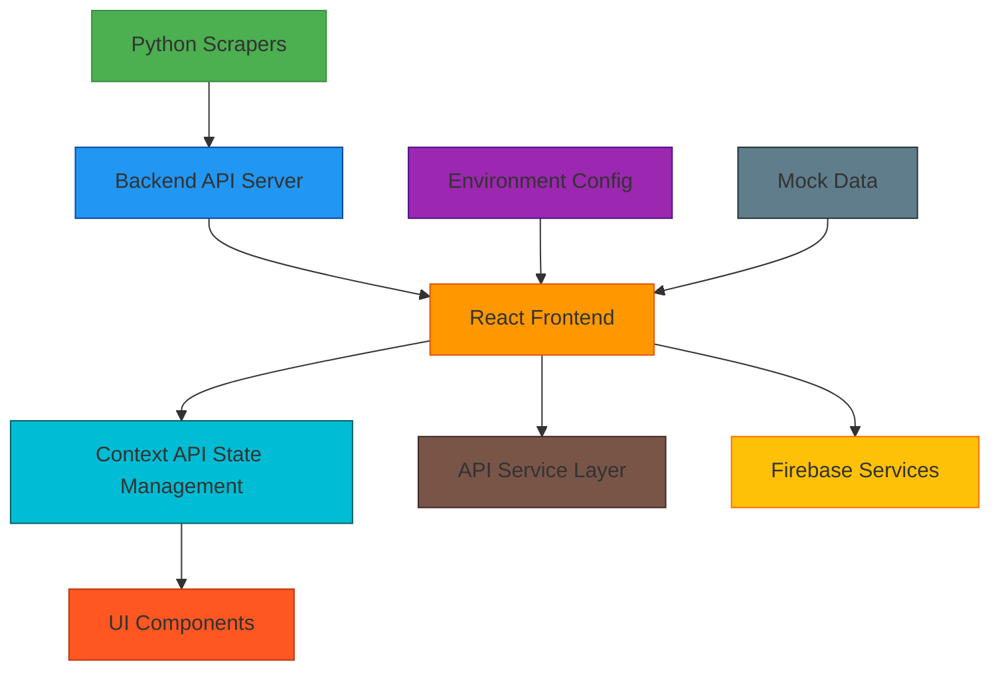
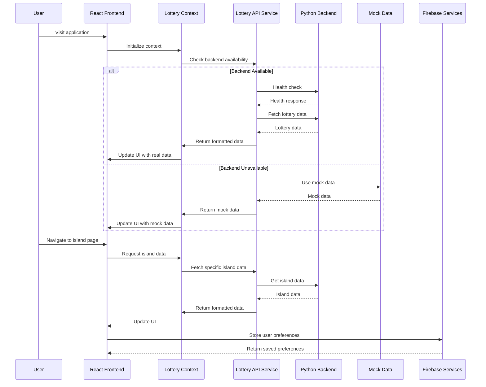

# React Scraper Integration Design Document

## 1. Overview

This document outlines the design and implementation of the integration between the Python lottery scrapers and the React frontend application for the "Today's Numbers" platform. The integration supports lottery data from 11 Caribbean islands and territories, providing real-time lottery results through a responsive web interface.

The integration follows a client-server architecture where:
- Python scrapers run on a backend server
- React frontend consumes data via RESTful API endpoints
- Data is managed through React Context API for state management
- Fallback mechanisms ensure graceful degradation when backend is unavailable

This integration aligns with the project's mobile-first design principles and leverages the existing Firebase backend services for authentication and data storage where applicable. The system maintains real-time data synchronization capabilities through the existing infrastructure while adding the Python scraper data layer.

## 2. Architecture

### 2.1 System Components



### 2.2 Data Flow



## 3. Component Architecture

### 3.1 API Service Layer

The `LotteryAPI` service class (`src/services/lotteryAPI.ts`) provides a clean abstraction over HTTP requests to the Python backend:

- **Health Check**: `/health` endpoint to verify backend availability
- **Data Retrieval**: Endpoints for all islands summary and individual island data
- **Error Handling**: Comprehensive error handling with meaningful messages
- **Data Formatting**: Utility methods to format API responses for UI components
- **Backend Detection**: Methods to check if backend is available

This service layer integrates with the existing Firebase authentication system where needed and follows the project's TypeScript strict mode requirements with proper typing and null safety handling.

### 3.2 State Management

The `LotteryContext` (`src/contexts/LotteryContext.tsx`) manages global lottery data state:

- **State**: Islands data, loading states, error states, backend connection status
- **Actions**: Fetch all data, fetch specific island data, refresh data, clear errors
- **Auto-refresh**: Configurable interval-based data refreshing
- **Mock Data Fallback**: Graceful degradation when backend is unavailable

This context provider follows the project's established patterns for state management and integrates with the existing `IslandContext` and `AuthContext` providers. It maintains real-time data synchronization capabilities with proper error handling and graceful fallback to mock data when needed, aligning with the project's real-time data synchronization requirements with Firestore.

### 3.3 UI Components

#### 3.3.1 Dashboard Components

- **AllIslandsDashboard** (`src/components/AllIslandsDashboard.tsx`): Grid view of all 11 Caribbean islands with lottery data
- **LotteryCard** (`src/components/cards/LotteryCard.tsx`): Individual card component displaying lottery data for one island
- **IslandPage** (`src/components/pages/IslandPage.tsx`): Detailed view for a specific island with tabs for lottery, history, statistics

These components follow the project's Material UI (MUI) component usage patterns and styling conventions. They implement the mobile-first design principles with responsive layouts and touch-friendly interfaces. All components use proper TypeScript typing and follow the project's strict mode requirements with appropriate null safety handling.

#### 3.3.2 Layout Components

- **Header** (`src/components/Header.tsx`): Navigation header with links to all islands dashboard
- **ErrorBoundary** (`src/components/ErrorBoundary.tsx`): Error handling wrapper for components

## 4. API Endpoints Reference

### 4.1 Core Endpoints

| Endpoint | Method | Description | Authentication |
|----------|--------|-------------|----------------|
| `/health` | GET | Health check for backend service | None |
| `/api/v1/lottery/summary/all` | GET | Summary data for all 11 islands | None |
| `/api/v1/lottery/latest/{island}` | GET | Latest lottery data for specific island | None |
| `/api/v1/lottery/history/{island}` | GET | Historical lottery data for specific island | None |
| `/api/v1/metrics/scraper-status` | GET | Status of all scrapers | None |

### 4.2 Request/Response Schema

#### 4.2.1 Island Response Schema

```json
{
  "island": "string",
  "operator": "string",
  "games": [
    {
      "game": "string",
      "numbers": [1, 2, 3, 4, 5, 6],
      "draw_date": "ISO8601 datetime",
      "jackpot": 100000.0
    }
  ],
  "last_updated": "ISO8601 datetime",
  "total_games": 10
}
```

## 5. Data Models & State Structure

### 5.1 Frontend State Model

```typescript
interface LotteryState {
  islands: { [key: string]: IslandData };
  loading: boolean;
  error: string | null;
  lastUpdated: string | null;
  backendConnected: boolean;
  refreshing: boolean;
}

interface IslandData {
  id: string;
  island: string;
  displayName: string;
  operator?: string;
  games: FormattedLotteryGame[];
  last_updated: string;
  lastUpdatedFormatted: string;
  total_games: number;
}

interface FormattedLotteryGame {
  id: string;
  game: string;
  numbers: number[];
  draw_date: string;
  jackpot?: number;
  drawDateFormatted?: string | null;
  jackpotFormatted?: string | null;
}
```

## 6. Business Logic Layer

### 6.1 Data Fetching Logic

The integration follows this logic for data retrieval:

1. **Backend Availability Check**: 
   - Attempt to connect to backend via health check endpoint
   - Set backend connection status in context

2. **Data Retrieval**:
   - If backend available: Fetch real data from Python scrapers
   - If backend unavailable and mock data enabled: Use mock data
   - If backend unavailable and mock data disabled: Show error state

3. **Data Formatting**:
   - Format dates for local display
   - Format currency values
   - Add unique identifiers for React keys

### 6.2 Auto-refresh Mechanism

- Configurable refresh interval (default: 5 minutes)
- Prevents overlapping requests
- Visual indication of refreshing state
- Error handling for failed refreshes

### 6.3 Error Handling

- **Network Errors**: Connection timeouts, DNS failures
- **HTTP Errors**: 404, 500 series errors
- **Data Errors**: Malformed responses, missing fields
- **Fallback Strategy**: Mock data when real data unavailable

## 7. Configuration & Environment

### 7.1 Environment Variables

| Variable | Default | Description |
|----------|---------|-------------|
| `VITE_API_URL` | `http://localhost:8000` | Backend API base URL |
| `VITE_API_VERSION` | `v1` | API version |
| `VITE_REQUEST_TIMEOUT` | `30000` | Request timeout in milliseconds |
| `VITE_ENABLE_MOCK_DATA` | `true` | Enable mock data fallback |
| `VITE_REFRESH_INTERVAL` | `300000` | Auto-refresh interval in milliseconds |

### 7.2 Supported Islands

All 11 Caribbean islands are supported:
1. St. Vincent & Grenadines
2. Grenada
3. Barbados
4. Jamaica
5. Trinidad & Tobago
6. St. Kitts & Nevis
7. Guyana
8. Belize
9. Antigua & Barbuda
10. St. Lucia
11. Dominica

## 8. Testing Strategy

### 8.1 API Integration Tests

The `test-lottery-api.js` script provides comprehensive testing of the integration:

- **Health Check**: Verify backend is responding
- **Data Retrieval**: Test fetching data for all islands
- **Individual Islands**: Test each island endpoint
- **Historical Data**: Test historical data endpoints
- **Error Handling**: Verify error responses are handled correctly

### 8.2 Component Tests

- **LotteryCard**: Rendering with real and mock data
- **AllIslandsDashboard**: Grid display and filtering
- **IslandPage**: Tab navigation and data display
- **Context Integration**: State management and updates

## 9. Performance Considerations

### 9.1 Caching Strategy

- Context API caching to prevent redundant requests
- Data persistence in state to maintain UI responsiveness
- Conditional fetching to avoid duplicate requests

### 9.2 Optimization Techniques

- **Code Splitting**: Lazy loading of components
- **Bundle Optimization**: Tree shaking and minification
- **Request Batching**: Combining multiple requests where possible
- **Responsive Design**: Mobile-first approach with adaptive layouts

## 10. Deployment Considerations

### 10.1 Production Configuration

- Update API URL to production backend
- Disable mock data in production
- Configure appropriate timeouts and refresh intervals
- Set up monitoring and error reporting

### 10.2 Scalability

- Horizontal scaling of backend services
- CDN for static assets
- Database optimization for historical data
- Load balancing for high-traffic scenarios