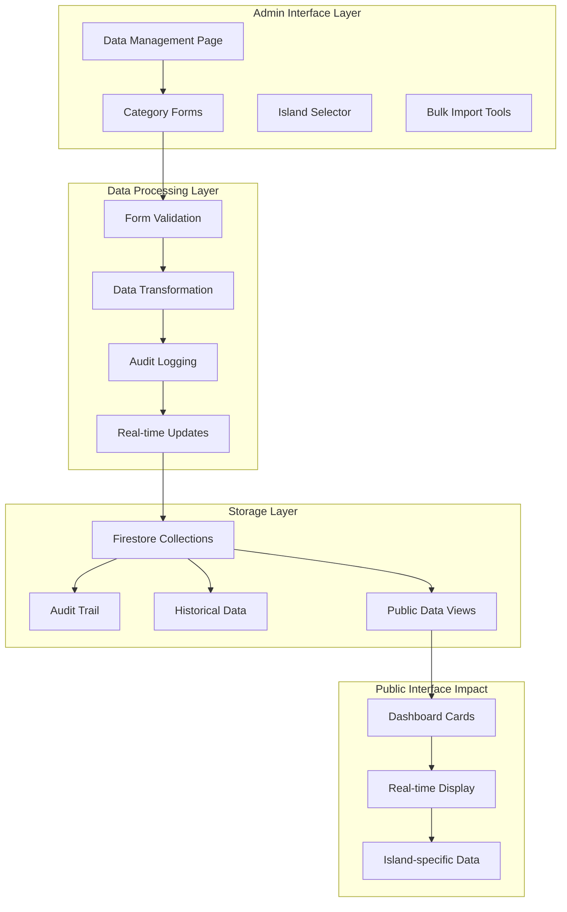
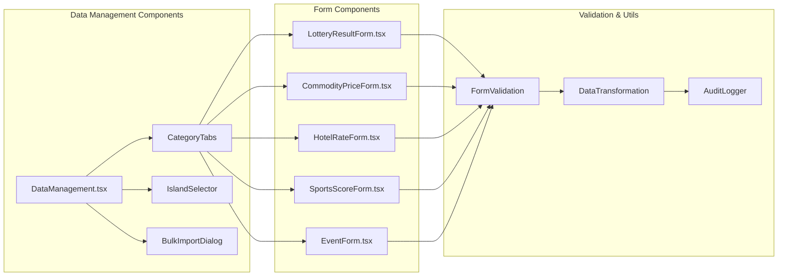
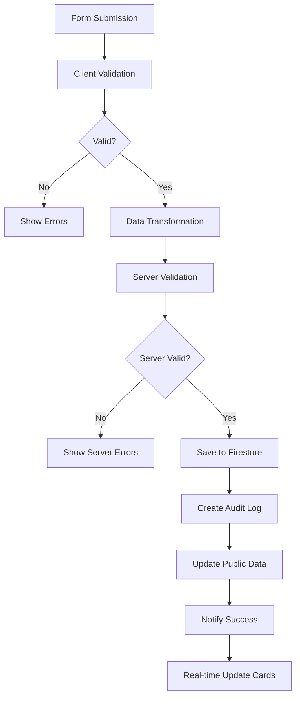

# Today's Numbers - Phase 4: Data Management Interface Design

## Overview

This design document outlines the implementation of Phase 4 of the Today's Numbers Caribbean Data Hub project, focusing on the Data Management Interface. Following the successful completion of Phase 3 (Ad Management System), this phase introduces comprehensive manual data entry capabilities for all data categories across Caribbean islands.

## Project Context

**Current Status**: Phase 3 Complete (60% Overall Progress)
- ✅ Phase 1: Firebase & Authentication (100%)
- ✅ Phase 2: Admin Layout & Navigation (100%)  
- ✅ Phase 3: Ad Management System (100%)
- 🎯 **Phase 4: Data Management Interface (Target: 0% → 100%)**

**Technology Stack**:
- React 18.2.0 + TypeScript 5.2.2
- Material UI 5.14.20 + Emotion
- Firebase 12.1.0 (Firestore + Auth)
- Vite 5.0.0 build system

## Architecture

### System Architecture Overview



### Component Architecture



## Data Models & Schema

### Core Data Collections

#### Lottery Results
```typescript
interface LotteryResult {
  id: string;
  islandId: string;
  numbers: number[];
  drawDate: Date;
  drawType: 'daily' | 'weekly' | 'special';
  jackpot?: number;
  specialFeatures?: string[];
  createdBy: string;
  createdAt: Date;
  updatedAt?: Date;
  isActive: boolean;
}
```

#### Commodity Prices
```typescript
interface CommodityPrice {
  id: string;
  islandId: string;
  itemName: string;
  price: number;
  unit: string;
  market: string;
  currency: string;
  priceChange?: number;
  lastUpdated: Date;
  createdBy: string;
  isActive: boolean;
}
```

#### Hotel Rates
```typescript
interface HotelRate {
  id: string;
  islandId: string;
  hotelName: string;
  roomType: string;
  pricePerNight: number;
  currency: string;
  starRating: number;
  amenities: string[];
  availability: boolean;
  contactInfo: ContactInfo;
  createdBy: string;
  validUntil: Date;
  isActive: boolean;
}
```

#### Sports Scores
```typescript
interface SportsScore {
  id: string;
  islandId: string;
  teams: string[];
  score?: string;
  gameDate: Date;
  league: string;
  venue?: string;
  status: 'scheduled' | 'live' | 'finished';
  createdBy: string;
  createdAt: Date;
  isActive: boolean;
}
```

#### Events
```typescript
interface Event {
  id: string;
  islandId: string;
  eventName: string;
  venue: string;
  eventDate: Date;
  ticketPrice?: number;
  currency?: string;
  description: string;
  category: string;
  organizer?: string;
  createdBy: string;
  isActive: boolean;
}
```

### Firestore Collection Structure

```
/data_management/
  ├── /lottery_results/{islandId}/
  ├── /commodity_prices/{islandId}/
  ├── /hotel_rates/{islandId}/
  ├── /sports_scores/{islandId}/
  ├── /events/{islandId}/
  └── /audit_logs/

/data_management_entries/
  ├── /{entryId}/ (cross-category tracking)
```

## Component Specifications

### 1. DataManagement.tsx (Main Interface)

**Location**: `src/components/admin/pages/DataManagement.tsx`

**Purpose**: Central hub for all data management operations with tabbed interface for different categories.

**Key Features**:
- Tabbed navigation for data categories
- Island selection with persistence
- Quick stats overview
- Recent entries display
- Bulk operations access

**Component Structure**:
```typescript
interface DataManagementState {
  selectedTab: number;
  selectedIsland: string;
  recentEntries: DataEntry[];
  stats: CategoryStats;
  loading: boolean;
}
```

### 2. Form Components (Already Implemented)

**Existing Forms**:
- ✅ `LotteryResultForm.tsx` - Lottery number entry
- ✅ `CommodityPriceForm.tsx` - Market price updates
- ✅ `HotelRateForm.tsx` - Hotel pricing management
- ✅ `SportsScoreForm.tsx` - Sports results entry
- ✅ `EventForm.tsx` - Event creation and management

**Form Enhancement Requirements**:
- Island-specific validation
- Real-time preview
- Draft saving capability
- Bulk entry support
- Data conflict resolution

### 3. Validation Layer

**Validation Rules**:
```typescript
interface ValidationRules {
  lottery: {
    numbers: { min: 1, max: 50, required: true };
    drawDate: { futureOnly: false, required: true };
    jackpot: { min: 0, currency: true };
  };
  commodity: {
    price: { min: 0, required: true };
    itemName: { minLength: 2, required: true };
    market: { predefined: true };
  };
  hotel: {
    pricePerNight: { min: 0, required: true };
    starRating: { min: 1, max: 5 };
    amenities: { maxItems: 10 };
  };
  sports: {
    teams: { minItems: 2, maxItems: 2 };
    gameDate: { futureAllowed: true };
    score: { format: 'team1-team2' };
  };
  event: {
    eventDate: { futureOnly: true, required: true };
    ticketPrice: { min: 0, currency: true };
    venue: { required: true };
  };
}
```

### 4. Data Processing Pipeline



## Business Logic Layer

### Data Entry Workflow

1. **Category Selection**: Admin selects data category (lottery, commodity, hotel, sports, event)
2. **Island Context**: System maintains selected island context throughout session
3. **Form Completion**: Admin fills category-specific form with validation
4. **Preview & Confirmation**: Real-time preview of how data appears on public cards
5. **Submission & Processing**: Data validation, transformation, and storage
6. **Audit Logging**: All actions logged with admin ID, timestamp, and details
7. **Real-time Updates**: Public dashboard cards update automatically

### Island-Specific Data Management

```typescript
interface IslandDataContext {
  selectedIsland: string;
  availableCategories: string[];
  dataPermissions: {
    canCreate: boolean;
    canUpdate: boolean;
    canDelete: boolean;
  };
  recentActivity: DataActivity[];
}
```

### Conflict Resolution

**Duplicate Entry Prevention**:
- Same-day lottery results checking
- Duplicate commodity-market combinations
- Hotel room-type conflicts
- Event scheduling conflicts

**Data Versioning**:
- Historical data preservation
- Update tracking with timestamps
- Rollback capabilities for critical errors

## Testing Strategy

### Unit Testing Requirements

**Form Component Tests**:
```typescript
describe('LotteryResultForm', () => {
  it('validates lottery numbers correctly');
  it('prevents future draw dates for daily lottery');
  it('handles jackpot amount formatting');
  it('submits data with proper audit trail');
});

describe('CommodityPriceForm', () => {
  it('validates price format and currency');
  it('prevents negative prices');
  it('calculates price change percentage');
  it('handles market selection validation');
});
```

**Integration Tests**:
- Firebase connection and data persistence
- Real-time updates to public cards
- Cross-component state management
- Audit logging functionality

**End-to-End Tests**:
- Complete data entry workflow
- Island switching scenarios
- Error handling and recovery
- Mobile responsive behavior

### Performance Testing

**Load Testing**:
- Concurrent form submissions
- Large bulk import operations
- Real-time update performance
- Mobile device performance

**Optimization Targets**:
- Form load time: <2 seconds
- Submission processing: <3 seconds
- Real-time update delay: <1 second
- Mobile responsiveness: 90+ Lighthouse score

## Security & Access Control

### Permission-Based Access

```typescript
interface DataPermissions {
  lottery: {
    create: ['super_admin', 'island_admin'];
    update: ['super_admin'];
    delete: ['super_admin'];
  };
  commodity: {
    create: ['super_admin', 'island_admin'];
    update: ['super_admin', 'island_admin'];
    delete: ['super_admin'];
  };
  // ... other categories
}
```

### Firestore Security Rules

```javascript
rules_version = '2';
service cloud.firestore {
  match /databases/{database}/documents {
    // Data Management Collections
    match /data_management/{category}/islands/{islandId}/{document} {
      allow read, write: if request.auth != null && 
        request.auth.token.email in ['admin@todaysnumbers.com'] &&
        isValidDataEntry(resource.data);
    }
    
    // Audit logs - read-only for admins
    match /audit_logs/{logId} {
      allow read: if request.auth != null && 
        request.auth.token.email in ['admin@todaysnumbers.com'];
      allow write: if false; // Only server-side writes
    }
  }
}
```

### Audit Trail Requirements

**Comprehensive Logging**:
- All data creation, updates, and deletions
- Failed submission attempts
- Session management events
- Permission checks and violations

**Audit Log Structure**:
```typescript
interface AuditLog {
  id: string;
  adminId: string;
  adminEmail: string;
  action: 'create' | 'update' | 'delete' | 'view';
  category: 'lottery' | 'commodity' | 'hotel' | 'sports' | 'event';
  islandId: string;
  targetId: string;
  timestamp: Date;
  details: string;
  ipAddress?: string;
  userAgent?: string;
  previousValue?: any;
  newValue?: any;
}
```

## Implementation Roadmap

### Week 1: Core Data Management Interface

**Day 1-2**: DataManagement.tsx Implementation
- Create main component with tabbed interface
- Implement island selection and persistence
- Add navigation between existing forms

**Day 3-4**: Form Integration & Enhancement
- Integrate existing forms into tabbed interface
- Add island context to all forms
- Implement real-time preview functionality

**Day 5**: Validation & Error Handling
- Enhance client-side validation
- Add server-side validation layer
- Implement comprehensive error messaging

### Week 2: Advanced Features & Polish

**Day 1-2**: Bulk Operations
- Design and implement bulk import interface
- Add CSV/Excel import capabilities
- Create data conflict resolution workflows

**Day 3-4**: Real-time Updates & Performance
- Optimize Firestore queries and listeners
- Implement efficient real-time updates
- Add loading states and performance monitoring

**Day 5**: Testing & Documentation
- Comprehensive testing of all components
- Performance optimization
- Code documentation and cleanup

### Acceptance Criteria

**Functional Requirements**:
- [ ] All five data categories have functional entry forms
- [ ] Island-specific data management working correctly
- [ ] Real-time updates to public dashboard cards
- [ ] Comprehensive form validation (client and server)
- [ ] Audit logging for all administrative actions
- [ ] Bulk import capabilities for efficient data entry
- [ ] Mobile-responsive design (320px-1920px)
- [ ] Error handling and recovery mechanisms

**Performance Requirements**:
- [ ] Form load time under 2 seconds
- [ ] Data submission processing under 3 seconds
- [ ] Real-time updates visible within 1 second
- [ ] Mobile Lighthouse score above 90
- [ ] Zero TypeScript compilation errors

**Security Requirements**:
- [ ] Role-based access control functional
- [ ] Firestore security rules properly configured
- [ ] All actions logged in audit trail
- [ ] Session management with proper timeouts
- [ ] Data validation prevents malicious input

## Risk Mitigation

**Technical Risks**:
- **Form Complexity**: Mitigated by modular design and comprehensive testing
- **Real-time Performance**: Optimized queries and efficient state management
- **Data Conflicts**: Conflict detection and resolution workflows
- **Mobile Performance**: Progressive loading and optimization

**Data Risks**:
- **Data Loss**: Comprehensive backup and audit trail
- **Data Corruption**: Validation layers and rollback capabilities
- **Access Control**: Multi-layer permission checking
- **Audit Compliance**: Comprehensive logging and monitoring

**User Experience Risks**:
- **Form Complexity**: Progressive disclosure and intuitive design
- **Error Recovery**: Clear error messages and guidance
- **Performance**: Loading states and progress indicators
- **Mobile Usability**: Touch-friendly design and responsive layout