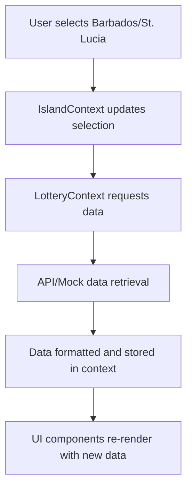

# Design Document: Barbados and St. Lucia Lottery Games Implementation

## 1.1 Objective

Implement public main-page cards for Barbados and St. Lucia lottery games as specified in NextTask.md. This includes:

- Creating schema-compliant mock data for all required games
- Ensuring UI placeholders display correctly
- Preparing for future real scraper mapping
- Supporting multi-draw games with multiple time slots per day
- Ensuring both islands are properly displayed in the all-islands view

## 1. Overview

This document outlines the implementation plan for enhancing Barbados and St. Lucia lottery games in the Today's Numbers application. The implementation will include:

- Verifying Barbados and St. Lucia are in the island registry (already present)
- Creating comprehensive mock data for all required lottery games
- Updating the lottery context to support all games for these islands
- Ensuring UI components properly display the new games
- Preparing for future integration with real scrapers

## 2. Architecture

### 2.1 System Components

The implementation will leverage existing components in the system:

- **IslandContext**: Manages island selection and persistence (no changes needed as both islands are already registered)
- **LotteryContext**: Manages lottery data state and API interactions (enhanced with mock data)
- **LotteryCard**: Displays lottery games for a specific island (existing, will display new games)
- **ComprehensiveIslandCard**: Shows overview information for an island in the all-islands view (existing)
- **LotteryAPI**: Handles communication with backend services (existing)
- **AllIslandsDashboard**: Displays all islands in a grid view (existing, will show Barbados and St. Lucia)

### 2.2 Data Flow



### 2.3 Component Structure

The new implementation will follow the existing component structure:
```
src/
├── context/
│   └── IslandContext.tsx (no changes needed)
├── contexts/
│   └── LotteryContext.tsx (updated with enhanced mock data)
├── components/
│   ├── cards/
│   │   └── LotteryCard.tsx (existing, will display new games)
│   └── ComprehensiveIslandCard.tsx (existing, will show new islands)
```

## 3. Data Models

### 3.1 Island Data Model

The existing `Island` interface will be used for Barbados and St. Lucia:

```typescript
interface Island {
  id: string;          // 'barbados' or 'st-lucia'
  name: string;        // 'Barbados' or 'St. Lucia'
  flag: string;        // '🇧🇧' or '🇱🇨'
  country_code: string;// 'BB' or 'LC'
  timezone: string;    // 'America/Barbados' or 'America/St_Lucia'
  currency: string;    // 'BBD' or 'XCD'
  region: string;      // 'Lesser Antilles' or 'Windward Islands'
  population?: number; // Population data if available
}
```

Note: Both Barbados and St. Lucia are already defined in the existing `ISLANDS` array with the correct properties.

### 3.2 Lottery Game Data Model

The existing `LotteryGame` interface will be used with the following structure:

```typescript
interface LotteryGame {
  game: string;           // Name of the game (e.g., "Super Lotto")
  numbers: number[];      // Array of winning numbers
  draw_date: string;      // YYYY-MM-DD format
  jackpot?: number;       // Jackpot amount (optional)
  draw_number?: string;   // Draw identifier (optional)
  draw_time?: string;     // Time of draw (HH:MM or label)
}

interface FormattedLotteryGame extends LotteryGame {
  id: string;                     // Unique identifier
  drawDateFormatted?: string;     // Formatted date for display
  jackpotFormatted?: string;      // Formatted jackpot for display
}

interface FormattedIslandData {
  id: string;                     // Island identifier
  island: string;                 // Island name
  displayName: string;            // Display name
  operator?: string;              // Lottery operator
  games: FormattedLotteryGame[];  // Array of games
  last_updated: string;           // ISO timestamp
  lastUpdatedFormatted: string;   // Formatted timestamp
  total_games: number;            // Total number of games
}
```

### 3.3 Multi-Draw Game Data Model

For games with multiple draws per day (like Pick 3 and Pick 4), we will extend the model:

```typescript
interface MultiDrawGame extends FormattedLotteryGame {
  draws?: Array<{
    draw_date: string;
    draw_time: string;
    draw_number: string;
    numbers: number[];
    drawDateFormatted?: string;
  }>;
}
```

## 4. Implementation Details

### 4.1 Island Registration

Note: Barbados and St. Lucia are already present in the existing `ISLANDS` array in `src/context/IslandContext.tsx`, so no changes are needed to this file.

### 4.2 Mock Data Implementation

Enhancement of the existing `getMockData` function in `src/contexts/LotteryContext.tsx` to include comprehensive mock data for Barbados and St. Lucia games. We need to enhance the mock data generation to include all the specific games for these islands:

#### Barbados Games:
1. **Super Lotto** - 6 numbers, evening draw, with jackpot
2. **Mega 6** - 6 numbers, Tuesday/Thursday/Friday/Saturday draw
3. **Pick 3** - 3 numbers, 4 draws per day (Morning, Midday, Sunset, Evening)
4. **Pick 4** - 4 numbers, same schedule as Pick 3

#### St. Lucia Games:
1. **Super 6** - 6 numbers, Tuesday/Friday evening draw, with jackpot
2. **Power Play** - Wednesday/Saturday evening draw
3. **Pick 2** - 2 numbers, 3 draws per day
4. **Lucky 3** - 3 numbers, 3 draws per day
5. **Big 4** - 4 numbers, 3 draws per day
6. **1-Off** - Game with specific schedule
7. **Double Daily Grand** - Game with specific schedule

#### Implementation Details

For multi-draw games like Pick 3 and Pick 4 that have multiple draws per day, we'll need to modify the UI to display all time slots. The mock data structure will need to accommodate this:

```typescript
// For single draw games (Super Lotto, Mega 6, etc.)
{
  id: 'barbados-super-lotto',
  game: 'Super Lotto',
  numbers: [2, 10, 16, 22, 29, 8],
  draw_date: '2025-09-16',
  draw_time: '21:00',
  draw_number: '20250916-SL',
  jackpotFormatted: 'BDS$1,718,700',
  drawDateFormatted: '9/16/2025'
}

// For multi-draw games (Pick 3, Pick 4, etc.)
{
  id: 'barbados-pick-3',
  game: 'Pick 3',
  draws: [
    {
      draw_date: '2025-09-13',
      draw_time: 'Morning',
      draw_number: '20250913-P3-M',
      numbers: [1, 2, 3],
      drawDateFormatted: '9/13/2025'
    },
    {
      draw_date: '2025-09-13',
      draw_time: 'Midday',
      draw_number: '20250913-P3-MD',
      numbers: [4, 5, 6],
      drawDateFormatted: '9/13/2025'
    },
    // Additional draws for Sunset and Evening
  ]
}
```

The `LotteryCard` component will need to be updated to handle both single-draw and multi-draw game formats.

#### Complete Mock Data Examples

Here are complete examples of the mock data that will be implemented:

**Barbados Mock Data:**
```javascript
[
  {
    id: 'barbados-super-lotto',
    game: 'Super Lotto',
    numbers: [2, 10, 16, 22, 29, 8],
    draw_date: '2025-09-16',
    draw_time: '21:00',
    draw_number: '20250916-SL',
    jackpot: 1718700,
    jackpotFormatted: 'BDS$1,718,700',
    drawDateFormatted: '9/16/2025'
  },
  {
    id: 'barbados-mega-6',
    game: 'Mega 6',
    numbers: [5, 12, 18, 25, 33, 41],
    draw_date: '2025-09-16',
    draw_time: '20:00',
    draw_number: '20250916-M6',
    drawDateFormatted: '9/16/2025'
  },
  {
    id: 'barbados-pick-3',
    game: 'Pick 3',
    draws: [
      {
        draw_date: '2025-09-13',
        draw_time: 'Morning',
        draw_number: '20250913-P3-M',
        numbers: [1, 2, 3],
        drawDateFormatted: '9/13/2025'
      },
      {
        draw_date: '2025-09-13',
        draw_time: 'Midday',
        draw_number: '20250913-P3-MD',
        numbers: [4, 5, 6],
        drawDateFormatted: '9/13/2025'
      },
      {
        draw_date: '2025-09-13',
        draw_time: 'Sunset',
        draw_number: '20250913-P3-S',
        numbers: [7, 8, 9],
        drawDateFormatted: '9/13/2025'
      },
      {
        draw_date: '2025-09-13',
        draw_time: 'Evening',
        draw_number: '20250913-P3-E',
        numbers: [0, 1, 2],
        drawDateFormatted: '9/13/2025'
      }
    ]
  }
]
```

**St. Lucia Mock Data:**
```javascript
[
  {
    id: 'st-lucia-super-6',
    game: 'Super 6',
    numbers: [1, 2, 13, 17, 20, 23],
    draw_date: '2025-09-12',
    draw_time: '21:00',
    draw_number: '20250912-S6',
    jackpot: 250000,
    jackpotFormatted: 'EC$250,000',
    drawDateFormatted: '9/12/2025'
  },
  {
    id: 'st-lucia-power-play',
    game: 'Power Play',
    numbers: [7, 14, 22, 29, 35, 42],
    draw_date: '2025-09-13',
    draw_time: '19:00',
    draw_number: '20250913-PP',
    drawDateFormatted: '9/13/2025'
  },
  {
    id: 'st-lucia-pick-2',
    game: 'Pick 2',
    draws: [
      {
        draw_date: '2025-09-12',
        draw_time: 'Morning',
        draw_number: '20250912-P2-M',
        numbers: [0, 3],
        drawDateFormatted: '9/12/2025'
      },
      {
        draw_date: '2025-09-12',
        draw_time: 'Midday',
        draw_number: '20250912-P2-MD',
        numbers: [5, 8],
        drawDateFormatted: '9/12/2025'
      },
      {
        draw_date: '2025-09-12',
        draw_time: 'Evening',
        draw_number: '20250912-P2-E',
        numbers: [2, 7],
        drawDateFormatted: '9/12/2025'
      }
    ]
  }
]
```

### 4.3 UI Display Requirements

The existing `LotteryCard` component will display the new games with the following requirements:

- Game name prominently displayed
- Draw date and time shown
- Draw number displayed if available
- Numbers displayed in colored circles
- Jackpot amount shown if available
- Multi-draw games (Pick 3, Pick 4, etc.) show all time slots
- Missing information gracefully handled with "Pending" or "N/A"

For multi-draw games like Pick 3 and Pick 4 that have multiple draws per day, the UI will need to display all time slots. This may require modifications to the existing `LotteryCard` component to handle games with multiple draw times.

### 4.4 Responsive Design

The implementation will maintain the existing responsive design:
- Grid layout on desktop showing multiple islands
- Stacked cards on mobile devices
- Consistent styling with the existing Caribbean-themed design system

The UI will adapt to show multiple draws for multi-draw games:
- On desktop: All draw times displayed in a grid
- On mobile: Collapsible sections for each draw time
- Consistent with the existing card-based design patterns

## 5. Business Logic

### 5.1 Data Formatting

The existing `formatLotteryData` function in `LotteryAPI` will handle formatting:
- Converting ISO dates to user-friendly formats
- Formatting jackpot amounts with appropriate currency symbols
- Generating unique IDs for games and islands

### 5.2 Mock Data Generation

Mock data will be generated with:
- Realistic number ranges for each game type
- Appropriate draw schedules as specified
- Currency formatting matching each island's currency
- Placeholder values for missing information

For multi-draw games, we will implement a special structure to handle multiple draws per day:

```typescript
interface MultiDrawGame {
  game: string;
  draws: Array<{
    draw_date: string;
    draw_time: string;
    draw_number: string;
    numbers: number[];
  }>;
}
```

### 5.3 Error Handling

The implementation will follow existing error handling patterns:
- Graceful degradation to mock data when API is unavailable
- Clear error messages when data cannot be loaded
- Retry mechanisms for failed requests

## 6. Testing Strategy

### 6.1 Unit Tests

- Test mock data generation for both islands
- Verify data formatting functions
- Test island selection and persistence
- Validate multi-draw game data structures

### 6.2 Integration Tests

- Verify that new islands appear in the all-islands view
- Confirm that lottery cards display correctly
- Test responsive layout on different screen sizes
- Validate multi-draw game rendering

### 6.3 Manual Testing

- Verify all games display with correct information
- Check that multi-draw games show all time slots
- Confirm that missing information is handled gracefully
- Test on both desktop and mobile views
- Validate currency formatting for both islands
- Check draw time labels match requirements

### 6.4 Validation Tests

- Compare mock data against provided JSON examples
- Verify all required data fields are present
- Confirm schema compliance with NextTask.md requirements

## 7. Future Considerations

### 7.1 Scraper Integration

The implementation will prepare for future scraper integration by:
- Using the same data schema as defined in NextTask.md
- Ensuring field names match scraper output
- Maintaining flexibility for different draw schedules
- Using Lottery Guru selectors for these games as specified

### 7.2 Performance Optimization

- Leveraging existing React Query caching mechanisms
- Implementing lazy loading if needed for large datasets
- Optimizing re-renders with React.memo where appropriate

### 7.3 Extensibility

- Designing mock data structure to easily accommodate new games
- Maintaining consistency with existing code patterns
- Ensuring new components follow established conventions

### 7.4 Testing Considerations

- Using mock JSON examples to render cards and layout
- Checking for all games listed with correct fields
- Testing on both mobile and desktop views
- Verifying mapping correctness when real JSON is integrated

## 8. Implementation Steps

1. **Update LotteryContext mock data**:
   - Modify `getMockData` function in `src/contexts/LotteryContext.tsx`
   - Add comprehensive mock data for all Barbados games
   - Add comprehensive mock data for all St. Lucia games
   - Implement multi-draw structure for games with multiple daily draws

2. **Update UI components**:
   - Modify `LotteryCard` component to handle multi-draw games
   - Ensure proper display of all draw times for multi-draw games
   - Maintain consistent styling with existing components

3. **Testing and validation**:
   - Verify all games display correctly in the UI
   - Test responsive design on different screen sizes
   - Validate mock data against provided JSON examples
   - Confirm all required data fields are present and correctly formatted

4. **Prepare for scraper integration**:
   - Document data schema for scraper developers
   - Ensure field names match scraper output
   - Verify currency formatting matches island requirements

## 9. Key Requirements Summary

Based on NextTask.md, the key requirements for this implementation are:

1. **Data Fields**: Each card/JSON entry must include island, game, draw_date, draw_time, draw_number, numbers, and optional jackpot
2. **Barbados Games**: Super Lotto, Mega 6, Pick 3, and Pick 4
3. **St. Lucia Games**: Super 6, Power Play, Pick 2, Lucky 3, Big 4, 1-Off, and Double Daily Grand
4. **Schedule Requirements**:
   - Barbados Pick 3/Pick 4: 4 draws/day (Morning 10:00 AM, Midday 1:00 PM, Sunset 6:00 PM, Evening 9:00 PM)
   - Barbados Mega 6: Tue, Thu, Fri, Sat at ~8:00 PM
   - Barbados Super Lotto: Evening draws (example 9:00 PM)
   - St. Lucia Pick 2/Lucky 3/Big 4: 3 draws/day (Morning, Midday, Evening), Monday-Saturday
   - St. Lucia Super 6: Tue & Fri at ~21:00 (9 PM)
   - St. Lucia Power Play: twice per week (Wed & Sat draws, evening)
5. **UI Requirements**:
   - Cards display game name, draw_date, draw_time, draw_number (if available), numbers, jackpot if available
   - Multi-draw games show multiple time slots per day
   - Missing info gracefully handled with "Pending" or "N/A"
   - Responsive layout (grid on desktop, stacked cards on mobile)
6. **Schema Mapping**: Ensure scraper outputs JSON matching the specified data fields
7. **Testing**: Use mock JSON examples to render cards and layout, then verify with real JSON