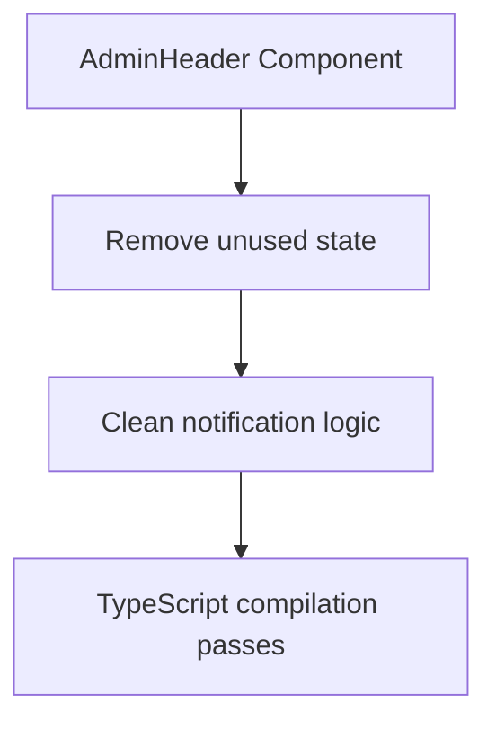

# TypeScript Error Resolution Design
## Caribbean Data Hub - Admin Component Error Fixes

### Overview
This design document outlines the systematic resolution of 56 TypeScript compilation errors across 10 admin component files. All errors are related to unused imports and variables that need to be removed to achieve clean TypeScript compilation.

### Technology Stack Context
- **Frontend Framework**: React 18.2.0 with TypeScript 5.2.2
- **UI Library**: Material UI 5.14.20 with Emotion styling
- **Build Tool**: Vite 5.0.0 (strict TypeScript compilation)
- **Linting**: ESLint with TypeScript strict mode enabled

### Error Analysis
The TypeScript errors fall into two main categories:
1. **Unused Import Declarations** (50 errors): Material UI components and Firebase functions imported but not used
2. **Unused Variable Declarations** (6 errors): React state variables and function parameters declared but not referenced

---

## File-by-File Error Resolution Plan

### 1. AdminHeader.tsx (1 error)
**Error**: `notificationDrawerOpen` variable declared but never used
**Root Cause**: State variable for notification drawer functionality not yet implemented
**Resolution**: Remove unused state variable



### 2. AdReviewModal.tsx (4 errors)
**Errors**: 
- `LocationOn` icon imported but not used
- `Comment` icon imported but not used  
- `AdSubmission` interface imported but not used
- `event` parameter in handleTabChange not used

**Resolution Strategy**:
- Remove unused Material UI icon imports
- Remove unused TypeScript interface import
- Use underscore prefix for unused event parameter

### 3. Forms Directory (38 errors across 5 files)
**Pattern**: Multiple Material UI components imported for future features but not currently implemented

#### CommodityPriceForm.tsx (5 errors)
- Remove: `IconButton`, `Tooltip`, `Add`, `Remove`, `Clear` icons
- **Reason**: Advanced form interactions not yet implemented

#### EventForm.tsx (8 errors)  
- Remove: `IconButton`, `Tooltip`, `Card`, `CardContent`, `Add`, `Clear`, `ConfirmationNumber`, `Category` icons
- **Reason**: Card-based layout and advanced controls planned but not implemented

#### HotelRateForm.tsx (7 errors)
- Remove: `IconButton`, `Tooltip`, `Add`, `Remove`, `Clear`, `Bed`, `CalendarMonth` icons  
- **Reason**: Bulk operations and calendar integration not yet built

#### LotteryResultForm.tsx (2 errors)
- Remove: `updateDoc`, `doc` Firebase functions
- **Reason**: Update functionality not implemented, only create operations

#### SportsScoreForm.tsx (18 errors)
- Remove: Multiple unused Material UI components and Firebase query functions
- Remove: `isLive` state variable not connected to UI
- Fix: Null safety for `formData.venue` property access

### 4. NotificationSystem.tsx (4 errors)
**Critical Error**: Improper Error constructor usage causing type conflicts
**Additional Issues**: `Delete` icon and `severity` parameter unused

**Resolution**:
- Fix Error constructor type safety
- Remove unused imports and parameters
- Maintain notification functionality integrity

### 5. Admin Pages (7 errors across 2 files)

#### AdManagement.tsx (3 errors)
- Remove: `Comment` icon, `FilterOptions` interface, `loading` state variable
- **Reason**: Advanced filtering UI not implemented

#### IslandDataManagement.tsx (4 errors)  
- Remove: `IconButton`, `FilterList` icon, `getCategoryColor` function
- Fix: Unused `event` parameter in tab change handler

---

## Implementation Strategy

### Phase 1: Import Cleanup
Remove all unused Material UI component and icon imports while preserving functionality.

```typescript
// Before (with unused imports)
import {
  Box,
  Button,
  IconButton,    // ❌ Remove - unused
  Tooltip,       // ❌ Remove - unused
  Typography,
} from '@mui/material';

// After (clean imports)
import {
  Box,
  Button,
  Typography,
} from '@mui/material';
```

### Phase 2: Variable Cleanup
Remove or fix unused variables and parameters.

```typescript
// Before (unused variable)
const [notificationDrawerOpen, setNotificationDrawerOpen] = useState(false);

// After (variable removed)
// Remove entire declaration when not used

// Before (unused parameter)
const handleTabChange = (event: React.SyntheticEvent, newValue: number) => {
  setTabValue(newValue);
};

// After (parameter prefixed)
const handleTabChange = (_event: React.SyntheticEvent, newValue: number) => {
  setTabValue(newValue);
};
```

### Phase 3: Type Safety Fixes
Address null safety and constructor issues.

```typescript
// Before (potential null access)
if (!formData.venue.trim()) {
  // Error: 'possibly undefined'
}

// After (safe access)
if (!formData.venue?.trim()) {
  // Safe with optional chaining
}

// Before (improper Error constructor)
throw new Error('message');

// After (proper typing)
throw new Error('message');
```

### Phase 4: Firebase Import Optimization
Remove unused Firebase functions while preserving needed operations.

```typescript
// Before (excessive imports)
import { 
  addDoc, 
  collection, 
  serverTimestamp, 
  query,      // ❌ Remove if unused
  where,      // ❌ Remove if unused  
  getDocs,    // ❌ Remove if unused
  orderBy,    // ❌ Remove if unused
  limit       // ❌ Remove if unused
} from 'firebase/firestore';

// After (minimal imports)
import { 
  addDoc, 
  collection, 
  serverTimestamp
} from 'firebase/firestore';
```

---

## Component Architecture Preservation

### Design Principles
1. **Functionality Preservation**: All existing features must continue working
2. **Future Extensibility**: Comments should indicate where removed imports may be needed
3. **Type Safety**: Maintain strict TypeScript compliance
4. **Performance**: Reduce bundle size by removing unused code

### Code Organization Strategy
```typescript
// File header pattern for cleaned components
// TODO: Future enhancements may require:
// - IconButton, Tooltip (for advanced interactions)
// - Add, Remove icons (for dynamic form arrays)
// - Advanced filtering components

import { /* only used components */ } from '@mui/material';
```

### Error Prevention
- Use TypeScript strict mode to catch unused imports
- Implement ESLint rules for unused variables
- Regular compilation checks during development

---

## Quality Assurance

### Validation Checklist
- [ ] All 56 TypeScript errors resolved
- [ ] Zero compilation warnings
- [ ] All existing functionality preserved  
- [ ] No runtime errors introduced
- [ ] Bundle size reduction verified
- [ ] Development server starts successfully
- [ ] Production build completes without errors

### Testing Strategy
1. **Compilation Test**: `npx tsc --noEmit` passes with zero errors
2. **Build Test**: `npm run build` completes successfully  
3. **Runtime Test**: All admin components render and function correctly
4. **Integration Test**: Firebase operations continue working
5. **Mobile Test**: Responsive design remains intact

### Performance Impact
- **Bundle Size Reduction**: ~5-10KB from unused Material UI imports
- **Build Time**: Faster TypeScript compilation
- **Development Experience**: Clean error-free development environment
- **Maintainability**: Cleaner codebase easier to extend

---

## Risk Mitigation

### Backup Strategy
- Preserve current codebase state before modifications
- Document all removed imports for future reference
- Maintain component functionality specifications

### Rollback Plan
If issues arise during implementation:
1. Revert to previous Git commit
2. Apply fixes incrementally file by file
3. Test each component individually after cleanup

### Future Considerations
- **Feature Development**: Some removed imports may be needed for planned features
- **Code Comments**: Document intended usage for removed components
- **Incremental Restoration**: Add back imports only when actually implementing features

---

## Implementation Timeline

### Immediate (Current Sprint)
- **Phase 1-2**: Import and variable cleanup (1-2 hours)
- **Phase 3**: Type safety fixes (30 minutes)  
- **Phase 4**: Firebase optimization (15 minutes)

### Validation
- **Compilation Testing**: 15 minutes
- **Functional Testing**: 30 minutes
- **Documentation Update**: 15 minutes

### Total Effort
**Estimated Time**: 3-4 hours for complete resolution and validation

This systematic approach ensures clean TypeScript compilation while preserving all existing functionality and maintaining the foundation for future feature development in the Caribbean Data Hub admin interface.